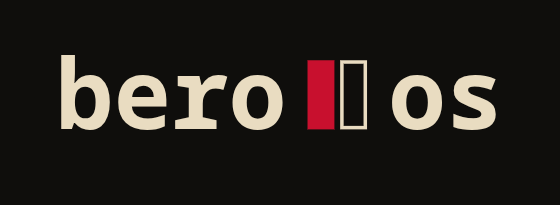
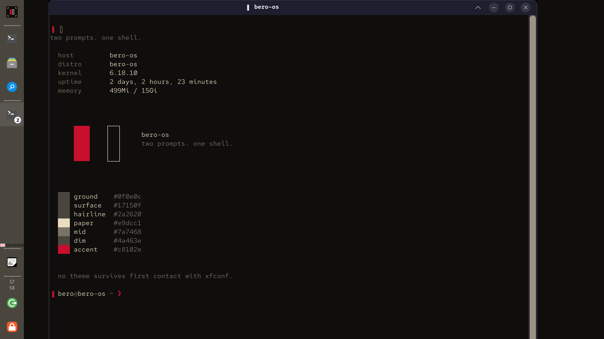
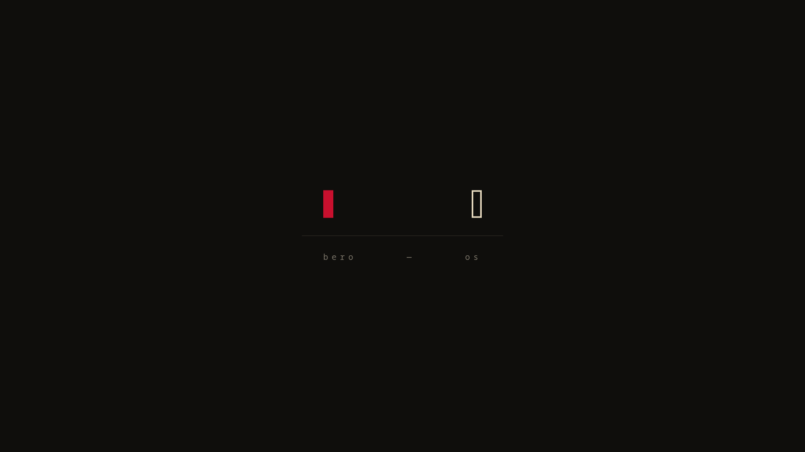

<p align="center">
  
</p>

<p align="center">
  <em>two prompts. one shell.</em>
</p>

---

# Bero-OS

A Linux distribution I built from source, one package at a time, on a 2012 ThinkPad X230. It started as a [Linux From Scratch](https://www.linuxfromscratch.org/) 13.0 (systemd) build and kept going: custom kernel, full X11 and XFCE desktop, NetworkManager, PipeWire, Nix on top for the stuff I don't want to compile, and a small brand around all of it.

It boots, it runs a desktop, it gets on wifi, it plays sound, and I daily-drive it from the laptop it lives on. Everything on the box that isn't a stock upstream file is mirrored in this repo.

<p align="center">
  
</p>

## What's actually in it

| Layer | What I built |
|---|---|
| Base | LFS 13.0-systemd, glibc 2.42, GCC 15.2, systemd 259, all built from source with the cross-toolchain, temporary tools, then chroot, exactly as the book lays it out |
| Kernel | Linux 6.18.10, my own config. Rebuilt twice to get audio working: the first rebuild was based on a wrong diagnosis, the second one found the real bug in the kernel source ([the story](configs/build-notes/kernel-audio.md)) |
| Network | NetworkManager 1.56 + wpa_supplicant, iwlwifi for the Intel 6205 card, hand-written fallback DNS so the box resolves before NM is up |
| Graphics | Mesa 25.3 (crocus for the Ivy Bridge iGPU), LLVM 21, Xorg 21.1, full xorg libs and fonts |
| Desktop | GTK 3, XFCE 4.20, LightDM with the GTK greeter, Catppuccin Mocha title bars, Papirus icons, a vertical dock I call the Workshop Rail |
| Sound | ALSA + PipeWire 1.6 + WirePlumber, Realtek ALC269VC codec |
| Package layer | Nix 2.34, multi-user, flakes-first. Firefox and Claude Code come from nixpkgs, everything else is compiled here |
| Toolchain | Rust 1.93, Python 3.14, Perl 5.42, cmake, meson, ninja. Around 300 packages in `/sources` |
| Brand | A palette, a two-cursor mark, Red Hat Mono everywhere, a `bero` CLI, and a few easter eggs I'm not going to list |

## How the repo works

The laptop is the source of truth for running state. The repo is the source of truth for configuration. The rule is simple: `configs/` mirrors the target filesystem, so `configs/etc/fstab` is `/etc/fstab` on the box, `configs/home/bero/.config/xfce4/...` is my XFCE state, and so on. After anything changes on the machine it gets copied back here and committed. A fresh rebuild should be able to take this tree and get the same system.

```
configs/
  boot/           kernel .config and grub.cfg
  etc/            system config: systemd units, PAM, fonts, profile.d, lightdm, NetworkManager, sshd
  home/bero/      user dotfiles and the full xfconf XML snapshot
  root/           root's dotfiles from before I moved to a normal user
  usr/            the bero CLI, the lightdm session wrapper, themes, brand assets, extra fonts
  var/            ALSA state
  patches/        patches I had to write when a package wouldn't build clean
  build-notes/    one file per thing that was harder than the book made it sound
JOURNAL.md        dated log of every session, written as I went
docs/             screenshots and longer write-ups
```

Wifi profiles never get mirrored. `.gitignore` blocks the whole `system-connections/` directory because those files hold the passphrase in cleartext.

## The build notes

These are the part of the repo I'd actually point someone at. Each one is a problem that cost me real time, what the symptom looked like, what was actually wrong, and the fix. A few worth reading:

- [kernel-audio.md](configs/build-notes/kernel-audio.md): HDA codec drivers built as modules never get loaded when the HDA core is built in, because `request_codec_module()` is compiled out under `#ifdef MODULE`. Kconfig doesn't warn. Two kernel rebuilds to find it.
- [librsvg-pixbuf-loader.md](configs/build-notes/librsvg-pixbuf-loader.md): librsvg ships with the gdk-pixbuf SVG loader disabled by default, so every SVG icon theme silently fell back to GTK's built-in PNGs for the first two weeks of the project.
- [gdk-pixbuf.md](configs/build-notes/gdk-pixbuf.md): the greeter crashed at first boot because gdk-pixbuf was built without image loaders. Same family of bug, found first.
- [networkmanager.md](configs/build-notes/networkmanager.md): three failed builds, three different reasons. Undeclared PyGObject dependency, typelib search paths in `/usr/lib64`, and xsltproc trying to fetch DocBook XSL over the network.
- [lightdm.md](configs/build-notes/lightdm.md): BLFS gives you the daemon and the greeter and nothing else. The systemd unit and the session wrapper are hand-written.
- [nix.md](configs/build-notes/nix.md): installing Nix on a non-NixOS from-source box, and the `profile.d` sort-order bug it exposed.
- [kernel-module-inventory.md](configs/build-notes/kernel-module-inventory.md): what the 11 modules on the system are, and why a `tainted=4` reading doesn't mean out-of-tree modules.
- [font-glyph-coverage.md](configs/build-notes/font-glyph-coverage.md), [desktop-theming.md](configs/build-notes/desktop-theming.md), [dns-fallback.md](configs/build-notes/dns-fallback.md), [sshd-keygen-guard.md](configs/build-notes/sshd-keygen-guard.md), [kitty-altscreen-scrollback.md](configs/build-notes/kitty-altscreen-scrollback.md), and [the rest](configs/build-notes/).

## The journal

[JOURNAL.md](JOURNAL.md) is the whole thing in order, from the first boot to the last session. It's written the way I'd tell it to a friend, not as documentation. The wrong turns are left in, because the wrong turns are where I learned the most: the audio misdiagnosis, the hour spent rebuilding icon caches when the real problem was a missing loader, the audit finding I pushed back on because its reading of the kernel taint bits was wrong.

## How I work on it

I build on the X230 itself, over SSH from my daily driver. Long compiles run in the background while I do other things. I use Claude Code as a build assistant for the repetitive parts, downloading, configuring, running the book's steps, and I do the diagnosis and the decisions. Every non-obvious fix gets a build note. Every session gets a journal entry. Nothing is installed without being mirrored back.

Some rules I set for myself early and kept:

- `-j4`, never more, the X230 has four threads.
- Read the source before trying kernel parameters. The audio fix came from `bind.c`, not from a forum.
- Audits and reviews are inputs, not orders. Verify the finding before acting on it.
- The accent colour goes on cursors, markers and one dot per screen. Never as a background.

## What's not done

A [self-audit against the BLFS book](docs/usable-base-audit-2026-05-31.md) in late May found the gaps honestly. The big ones, still open:

- The security base is a single-user convenience setup: root can SSH in with a password, there's no firewall because the kernel has no netfilter tables yet, GnuPG is a stub, and the PAM stack is minimal. All known, all planned as one coordinated hardening pass.
- The graphical session isn't registered with logind, because `pam_systemd.so` was never installed into PAM's module directory. Things work through fallbacks.
- The UI still renders in Luxi Sans because no proportional Noto or Liberation family was installed. The engine underneath (FreeType, HarfBuzz, fontconfig) is fine.
- No FUSE, exFAT or NTFS in the kernel, so removable media is FAT-only. One kernel rebuild fixes it, along with `THINKPAD_ACPI` for the Fn keys.
- The dock is a v1. It works, it looks like it's from 2002.

## Hardware

ThinkPad X230. Intel i5-3320M, 16 GB RAM, 256 GB SanDisk SSD, 1366x768 panel, Intel Centrino Advanced-N 6205 wifi, Realtek ALC269VC audio.

## Brand

The mark is two cursors: one filled, one outlined. Two prompts, one shell. Palette, wordmark and wallpapers live in `.brand/` and `configs/usr/local/share/bero-os/`.

<p align="center">
  
</p>
